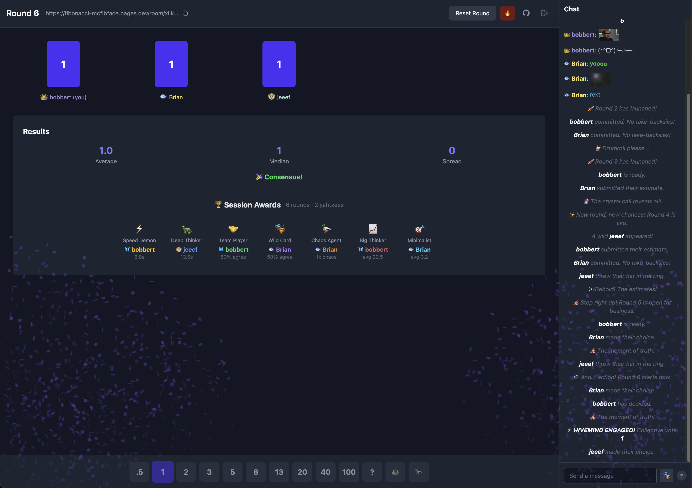

# fibonacci-mcfibface

**Free planning poker for agile teams. No accounts. No setup. Just vote.**

[**Start a Room**](https://fibonacci-mcfibface.pages.dev)



---

## What is this?

A real-time planning poker app for remote sprint planning. Create a room, share the link, and your team can vote on story points together. Cards stay hidden until everyone votes, then flip automatically with a satisfying reveal.

## Features

- **Zero friction** - No accounts, no sign-ups, no email verification. Enter your name and go.
- **End-to-end encrypted** - All room data is encrypted client-side. We can't see your votes or chat.
- **Real-time sync** - Everyone sees votes update instantly via WebSocket
- **Auto-reveal** - Cards flip automatically when all participants have voted
- **Built-in chat** - Discuss estimates without switching apps, with markdown support
- **Stats on reveal** - See average, median, and spread. Consensus gets confetti! 🎉
- **Auto-reconnect** - Connection drops? We'll reconnect automatically with status indicator.
- **Host controls** - Kick participants who are AFK or causing trouble
- **Persistent rooms** - Rooms stay alive indefinitely. Reconnect anytime with your same identity.
- **Mobile friendly** - Responsive grid works on phones and tablets

## Point Scale

`.5` `1` `2` `3` `5` `8` `13` `20` `40` `100` `?` `☕` `🦆`

Special votes:
- `?` - Unsure / needs discussion
- `☕` - Need a break
- `🦆` - Chaos vote

## How It Works

1. Go to [fibonacci-mcfibface.pages.dev](https://fibonacci-mcfibface.pages.dev)
2. Enter your name and click **Create Room**
3. Share the room URL with your team
4. Everyone picks a card - votes stay hidden until all are in
5. Cards auto-flip, stats appear, host clicks **Reset** for the next round

## Tech Stack

| Layer | Tech |
|-------|------|
| Frontend | Vite + TypeScript + Tailwind CSS |
| Backend | Cloudflare Workers + Durable Objects |
| Real-time | WebSocket |
| Hosting | Cloudflare Pages |
| Database | None - state lives in Durable Objects |

## Local Development

```bash
# Frontend (runs on :5173)
cd frontend && npm install && npm run dev

# Worker (runs on :8787)
cd worker && npm install && npx wrangler dev
```

## License

MIT
